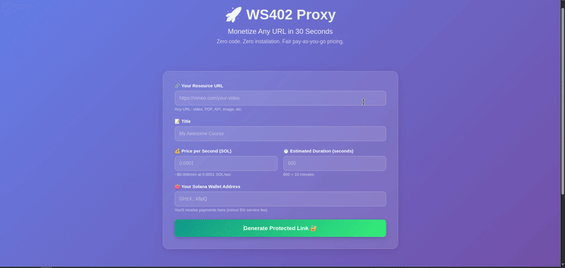
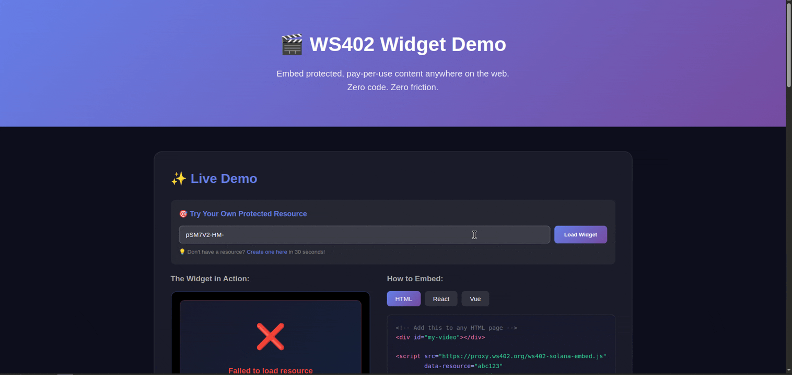

# WS402 Proxy Service 🚀

A powerful payment-gated content proxy service built on Solana blockchain using the WS402 protocol. Monetize your digital content (images, videos, audio, PDFs) with per-second micropayments.

## 🌟 Features

- **Pay-Per-Second Access**: Users pay only for the time they consume content
- **Solana Blockchain**: Fast, low-cost transactions on Solana
- **Automatic Refunds**: Unused funds are automatically refunded to users
- **Content Protection**: Hide original URLs behind masked endpoints
- **Real-time Payments**: WebSocket-based payment verification
- **Creator Revenue**: 95% revenue share for creators (5% service fee)
- **Multiple Media Types**: Support for images, videos, audio, and PDFs
- **Analytics Dashboard**: Track views, revenue, and engagement
- **Embed Support**: Easy integration with embed codes

## 🎬 Demo

### URL Proxy Protection


*Create payment-gated URLs and protect your content with per-second billing*

### Website Embedding


*Easily embed protected content into any website with our simple embed code*

## 📋 Table of Contents

- [Prerequisites](#prerequisites)
- [Installation](#installation)
- [Configuration](#configuration)
- [Running the Service](#running-the-service)
- [API Documentation](#api-documentation)
- [Usage Examples](#usage-examples)
- [Architecture](#architecture)
- [Environment Variables](#environment-variables)
- [Troubleshooting](#troubleshooting)
- [Contributing](#contributing)
- [License](#license)

## 🔧 Prerequisites

- **Node.js** v16+ and npm
- **Solana Wallet** with some SOL (devnet or mainnet)
- **Basic understanding** of Solana and WebSockets

## 📦 Installation

1. **Clone the repository**:
```bash
git clone <your-repo-url>
cd ws402-proxy-service
```

2. **Install dependencies**:
```bash
npm install
```

3. **Install required packages**:
```bash
npm install express ws cors dotenv @solana/web3.js ws402
```

## ⚙️ Configuration

### 1. Create `.env` file

Create a `.env` file in the root directory:

```env
# Server Configuration
PORT=4021
NODE_ENV=development

# Solana Configuration
SOLANA_NETWORK=devnet
SOLANA_RPC_URL=https://api.devnet.solana.com

# Service Wallet (Merchant)
SERVICE_WALLET_PUBLIC_KEY=YourPublicKeyHere
SERVICE_WALLET_PRIVATE_KEY=YourPrivateKeyHere

# Pricing Configuration
MIN_PRICE_PER_SECOND=1000
SERVICE_FEE_PERCENTAGE=5
MAX_SESSION_DURATION=3600

# CORS
ALLOWED_ORIGINS=http://localhost:3000,https://yourdomain.com
```

### 2. Get Your Solana Wallet Keys

**For Devnet Testing**:
```bash
# Generate new keypair
solana-keygen new --outfile ~/my-wallet.json

# Get public key
solana-keygen pubkey ~/my-wallet.json

# Get private key (as JSON array)
cat ~/my-wallet.json

# Fund with devnet SOL
solana airdrop 2 <YOUR_PUBLIC_KEY> --url devnet
```

**For Production**:
- Use your Phantom/Solflare wallet
- Export private key in base58 format
- Ensure wallet has sufficient SOL for transactions

### 3. Private Key Formats

The service accepts two private key formats:

**JSON Array Format** (recommended):
```env
SERVICE_WALLET_PRIVATE_KEY=[1,2,3,4,5,...]
```

**Base58 Format** (from Phantom/Solflare):
```env
SERVICE_WALLET_PRIVATE_KEY=5J6fd...base58string...
```

## 🚀 Running the Service

### Development Mode

```bash
npm run dev
```

### Production Mode

```bash
npm start
```

The server will start on `http://localhost:4021` (or your configured PORT).

## 📚 API Documentation

### 1. Create Masked Resource

**Endpoint**: `POST /api/mask`

Create a payment-gated resource.

**Request Body**:
```json
{
  "originalUrl": "https://example.com/image.jpg",
  "pricePerSecond": 100000,
  "estimatedDuration": 300,
  "title": "My Premium Content",
  "creatorWallet": "YourSolanaWalletAddress"
}
```

**Parameters**:
- `originalUrl` (required): Direct URL to media file
- `pricePerSecond` (required): Price in lamports (1 SOL = 1,000,000,000 lamports)
- `estimatedDuration` (optional): Estimated viewing time in seconds (default: 300)
- `title` (optional): Resource title (default: "Untitled Resource")
- `creatorWallet` (required): Creator's Solana wallet address

**Response**:
```json
{
  "success": true,
  "maskedId": "abc123",
  "accessUrl": "https://yourservice.com/watch/abc123",
  "schemaUrl": "https://yourservice.com/api/resource/abc123/schema",
  "embedCode": "<script src=\"...\"></script>",
  "qrCode": "https://yourservice.com/api/qr/abc123",
  "analytics": "https://yourservice.com/dashboard/abc123",
  "resource": {
    "id": "abc123",
    "title": "My Premium Content",
    "type": "image",
    "pricePerSecond": 100000,
    "priceSOL": "0.000100000 SOL",
    "estimatedDuration": 300,
    "totalEstimatedCost": 30000000,
    "totalEstimatedCostSOL": "0.030000000 SOL"
  }
}
```

### 2. Get Resource Schema (WS402)

**Endpoint**: `GET /api/resource/:maskedId/schema`

Get payment schema for WS402 protocol.

**Response**:
```json
{
  "ws402Schema": {
    "version": "1.0",
    "serviceName": "WS402 Proxy Payment",
    "pricePerSecond": 100000,
    "currency": "lamports",
    "estimatedDuration": 300,
    "paymentProvider": "solana",
    "websocketEndpoint": "wss://yourservice.com/ws402?resourceId=abc123&userId=",
    "resourceInfo": {
      "name": "My Premium Content",
      "type": "image",
      "estimatedTime": 300,
      "priceSOL": "0.000100000 SOL",
      "totalPriceSOL": "0.030000000 SOL"
    }
  }
}
```

### 3. Access Protected Resource

**Endpoint**: `GET /proxy/:maskedId?token=xxx`

Access the actual content (requires valid payment token).

**Parameters**:
- `maskedId`: The masked resource ID
- `token`: Access token received after payment verification

### 4. Get All Resources

**Endpoint**: `GET /api/resources`

List all masked resources.

**Response**:
```json
{
  "resources": [
    {
      "id": "abc123",
      "title": "My Premium Content",
      "type": "image",
      "pricePerSecond": 100000,
      "priceSOL": "0.000100000 SOL",
      "estimatedDuration": 300,
      "totalPrice": 30000000,
      "totalPriceSOL": "0.030000000 SOL",
      "views": 42,
      "createdAt": 1699564800000
    }
  ]
}
```

### 5. Get Resource Info

**Endpoint**: `GET /api/resource/:maskedId`

Get public information about a specific resource.

### 6. Get Analytics

**Endpoint**: `GET /api/resource/:maskedId/analytics`

Get detailed analytics for a resource.

### 7. Get Blockhash

**Endpoint**: `GET /blockhash`

Get latest Solana blockhash for client-side transactions.

### 8. Health Check

**Endpoint**: `GET /health`

Check service health and status.

**Response**:
```json
{
  "status": "ok",
  "activeSessions": 5,
  "activeHTTPSessions": 3,
  "maskedResources": 10,
  "solanaProvider": {
    "network": "devnet",
    "rpcEndpoint": "https://api.devnet.solana.com",
    "merchantWallet": "...",
    "autoRefundEnabled": true
  },
  "timestamp": 1699564800000
}
```

## 💡 Usage Examples

### Example 1: Protect an Image

```javascript
// Create masked resource
const response = await fetch('http://localhost:4021/api/mask', {
  method: 'POST',
  headers: { 'Content-Type': 'application/json' },
  body: JSON.stringify({
    originalUrl: 'https://example.com/premium-image.jpg',
    pricePerSecond: 100000, // 0.0001 SOL per second
    estimatedDuration: 60, // 1 minute
    title: 'Premium Artwork',
    creatorWallet: 'YourWalletAddress'
  })
});

const data = await response.json();
console.log('Access URL:', data.accessUrl);
console.log('Total cost:', data.resource.totalEstimatedCostSOL);
```

### Example 2: Embed Protected Content

```html
<!-- Add to your webpage -->
<script 
  src="https://yourservice.com/embed.js" 
  data-resource="abc123"
></script>
```

### Example 3: Direct Watch Link

Share the watch URL with users:
```
https://yourservice.com/watch/abc123
```

Users will:
1. See a payment prompt
2. Connect their Solana wallet
3. Pay the estimated amount
4. Get instant access to content
5. Receive automatic refund for unused time

## 🏗️ Architecture

```
┌─────────────┐
│   Client    │
│  (Browser)  │
└──────┬──────┘
       │
       │ 1. Request Schema
       ├──────────────────────────┐
       │                          │
       │                    ┌─────▼──────┐
       │                    │   Server   │
       │                    │  (Express) │
       │                    └─────┬──────┘
       │                          │
       │ 2. Get WS402 Schema      │
       │◄─────────────────────────┤
       │                          │
       │ 3. Connect WebSocket     │
       ├──────────────────────────►
       │                          │
       │ 4. Solana Payment        │
       ├──────────┐               │
       │          │               │
   ┌───▼────┐     │          ┌────▼─────┐
   │ Solana │     │          │  WS402   │
   │  RPC   │     │          │ Protocol │
   └───┬────┘     │          └────┬─────┘
       │          │               │
       │ 5. Verify Payment        │
       └──────────►───────────────►
                                  │
                  6. Grant Access │
       ◄──────────────────────────┤
       │                          │
       │ 7. Get HTTP Token        │
       │◄─────────────────────────┤
       │                          │
       │ 8. Access Content        │
       ├──────────────────────────►
       │                          │
       │ 9. Stream Content        │
       │◄─────────────────────────┤
       │                          │
       │ 10. Session End          │
       ├──────────────────────────►
       │                          │
       │ 11. Auto-Refund          │
       │◄─────────────────────────┤
       │                          │
```

## 🔐 Security Features

- **Content Protection**: Original URLs are never exposed to clients
- **Token-based Access**: Temporary tokens for resource access
- **Payment Verification**: Blockchain-verified payments
- **Session Tracking**: Secure session management
- **Automatic Cleanup**: Expired sessions and payments are cleaned automatically

## 💰 Pricing Examples

**Price in Lamports** (1 SOL = 1,000,000,000 lamports):

| Price per Second | SOL per Second | 1 Minute Cost | 5 Minutes Cost |
|------------------|----------------|---------------|----------------|
| 100,000         | 0.0001 SOL     | 0.006 SOL     | 0.03 SOL       |
| 500,000         | 0.0005 SOL     | 0.03 SOL      | 0.15 SOL       |
| 1,000,000       | 0.001 SOL      | 0.06 SOL      | 0.3 SOL        |
| 10,000,000      | 0.01 SOL       | 0.6 SOL       | 3 SOL          |

## 📊 Environment Variables

| Variable | Description | Default | Required |
|----------|-------------|---------|----------|
| `PORT` | Server port | 4021 | No |
| `NODE_ENV` | Environment | development | No |
| `SOLANA_NETWORK` | devnet or mainnet-beta | devnet | Yes |
| `SOLANA_RPC_URL` | Solana RPC endpoint | https://api.devnet.solana.com | Yes |
| `SERVICE_WALLET_PUBLIC_KEY` | Merchant public key | Generated | No* |
| `SERVICE_WALLET_PRIVATE_KEY` | Merchant private key | None | No** |
| `MIN_PRICE_PER_SECOND` | Minimum price in lamports | 1000 | No |
| `SERVICE_FEE_PERCENTAGE` | Platform fee % | 5 | No |
| `MAX_SESSION_DURATION` | Max session time (seconds) | 3600 | No |
| `ALLOWED_ORIGINS` | CORS origins | * | No |

\* If not provided, a temporary wallet is generated (not recommended for production)

\** Required for automatic refunds and creator payments

## 🐛 Troubleshooting

### Issue: "Invalid private key length"

**Solution**: Ensure your private key is in the correct format:
- JSON array: `[1,2,3,...]` (64 numbers)
- Base58: Full string from wallet export

### Issue: "Payment verification failed"

**Solution**: 
1. Check Solana network (devnet vs mainnet)
2. Verify RPC endpoint is accessible
3. Ensure wallet has sufficient SOL
4. Check transaction explorer for details

### Issue: "Resource not found"

**Solution**:
1. Verify the masked ID is correct
2. Check if resource was created successfully
3. Review server logs for errors

### Issue: "Auto-refund not working"

**Solution**:
1. Ensure `SERVICE_WALLET_PRIVATE_KEY` is set
2. Verify private key format is correct
3. Check wallet has SOL for transaction fees

## 🧪 Testing

### Test on Devnet

1. **Get Devnet SOL**:
```bash
solana airdrop 2 <YOUR_WALLET> --url devnet
```

2. **Create Test Resource**:
```bash
curl -X POST http://localhost:4021/api/mask \
  -H "Content-Type: application/json" \
  -d '{
    "originalUrl": "https://picsum.photos/800/600",
    "pricePerSecond": 100000,
    "estimatedDuration": 60,
    "title": "Test Image",
    "creatorWallet": "YOUR_WALLET_ADDRESS"
  }'
```

3. **Access Resource**:
Visit the returned `accessUrl` in your browser.

## 🤝 Contributing

Contributions are welcome! Please follow these steps:

1. Fork the repository
2. Create a feature branch
3. Make your changes
4. Test thoroughly
5. Submit a pull request

## 📄 License

This project is licensed under the MIT License - see the LICENSE file for details.

## 🙏 Acknowledgments

- Built with [WS402 Protocol](https://github.com/ws402/ws402)
- Powered by [Solana Blockchain](https://solana.com)
- Uses [@solana/web3.js](https://github.com/solana-labs/solana-web3.js)

## 🔗 WS402 Links

- 🌐 **Website**: [https://ws402.org](https://ws402.org)
- 📦 **NPM**: [https://npmjs.com/package/ws402](https://npmjs.com/package/ws402)
- 💬 **X (Twitter)**: [https://x.com/ws402org](https://x.com/ws402org)
- 🔗 **Farcaster**: [https://farcaster.xyz/ws402](https://farcaster.xyz/ws402)
- 💻 **GitHub**: [https://github.com/ws402/ws402](https://github.com/ws402/ws402)

## 📞 Support

For issues and questions:
- Open an issue on GitHub
- Check WS402 documentation: [https://ws402.org](https://ws402.org)
- Follow updates on X: [@ws402org](https://x.com/ws402org)

## 🚧 Roadmap

- [ ] Support for more payment providers
- [ ] Multi-currency support
- [ ] Advanced analytics dashboard
- [ ] NFT integration
- [ ] Mobile SDK
- [ ] Video streaming optimization
- [ ] Subscription models
- [ ] Rate limiting and DDoS protection

---

**Made with ❤️ using Solana and WS402**

*Last updated: November 2025*